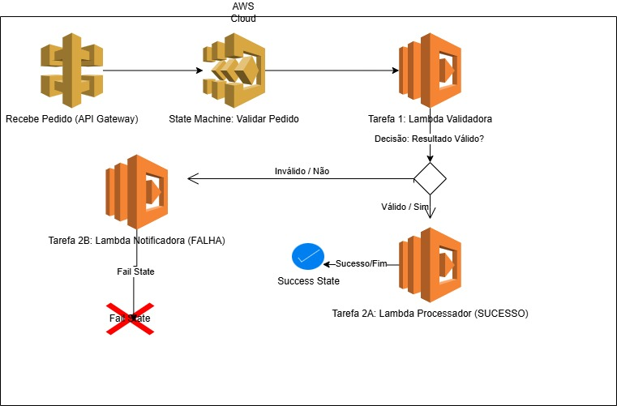

# Desafio DIO: Orquestração Serverless com AWS Step Functions

## Visão Geral e Contexto

Este repositório documenta a entrega do desafio de **Workflows Automatizados com AWS Step Functions** da DIO.

O projeto demonstra a implementação de uma **máquina de estados (State Machine)** na AWS para orquestrar um fluxo de trabalho de processamento de dados, utilizando o paradigma *serverless*. O foco é na resiliência, na lógica de decisão e na documentação do aprendizado prático.

| Detalhe | Valor |
| :--- | :--- |
| **Orquestrador Central** | AWS Step Functions (Tipo Standard) |
| **Serviços Integrados** | AWS Lambda, Amazon SNS, Amazon States Language (ASL) |
| **Idioma do Projeto** | Python 3.9+ |

---

## 1. Arquitetura e Fluxo de Trabalho

O workflow implementado simula um processo de **validação de pedidos de serviço** antes do processamento final, garantindo que apenas dados válidos avancem.

### Diagrama da State Machine

O fluxo é definido por uma sequência lógica de tarefas e decisões, conforme ilustrado no diagrama da máquina de estados:

### Descrição do Fluxo Lógico

1.  **`Task: ValidarDados`**: Estado inicial que invoca a função Lambda `validador-lambda` (código em `lambda-functions/validador.py`). A função verifica a presença de campos obrigatórios no payload.
2.  **`Choice: VerificarStatus`**: Estado de decisão. Ele inspeciona a chave `$.status` na saída da validação.
    * Se `$.status == "APROVADO"`, o fluxo segue para `ProcessarPedido`.
    * Se `$.status == "REJEITADO"`, o fluxo segue para `NotificarErro`.
3.  **`Task: ProcessarPedido`**: Invoca a função Lambda `processador-lambda`. Esta função simula a lógica de negócio principal (ex: persistência de dados em um banco de dados) e avança para `Sucesso`.
4.  **`Task: NotificarErro`**: Utiliza a integração otimizada com **Amazon SNS** para publicar uma mensagem em um tópico (`sns:Publish`), alertando sobre o pedido rejeitado, e avança para `Falha`.
5.  **`Succeed` / `Fail`**: Estados finais que marcam o término da execução, proporcionando clareza sobre o resultado final.

---

## 2. Implementação Técnica e Conceitos Aplicados

O projeto utilizou conceitos essenciais do Step Functions para garantir um fluxo de trabalho eficiente e observável.

### Tipos de Estados ASL e Controle de Fluxo

* **`Type: Task`:** Utilizado para conectar-se e executar funções Lambda e ações de API de outros serviços (como o SNS).
* **`Type: Choice`:** Essencial para adicionar a **inteligência condicional** no fluxo, permitindo que a State Machine tome decisões baseadas em dados (JSON) em tempo de execução.
* **`InputPath`, `ResultPath`, `OutputPath`:** Implementação da gestão de *payloads* (dados JSON) entre os estados. Garanti que o *payload* de saída de um estado fosse filtrado ou transformado antes de ser passado como entrada para o próximo, prevenindo o problema de limite de tamanho de 256KB.

### Resiliência e Integrações

* **Integração Otimizada com SNS:** Em vez de usar uma Lambda para enviar a notificação (o que geraria código e custo desnecessários), utilizei o Step Functions para chamar diretamente a API do Amazon SNS, simplificando o código e a arquitetura.
* **Tratamento de Erros:** O estado `ValidarDados` foi configurado com um bloco `Retry` que tenta reexecutar a Lambda até 3 vezes em caso de erros transientes (ex: `Lambda.ClientExecutionTimeout`), aumentando a resiliência do fluxo.

---

## 3. Insights e Experiências Adquiridas (O Destaque)

O desafio consolidou o entendimento sobre a importância da orquestração na arquitetura Serverless.

* **Separação de Preocupações (SoC):** O principal aprendizado foi a capacidade do Step Functions de assumir a responsabilidade pela **gestão do fluxo e do estado**, liberando as funções Lambda para se concentrarem estritamente na **lógica de negócio**. Isso resulta em Lambdas menores, mais fáceis de testar e manter.
* **Observabilidade Inerente:** A maior vantagem operacional é a **visualização do fluxo de execução** no console. Isso eliminou a necessidade de rastrear logs complexos, permitindo identificar o estado e o ponto exato de falha em segundos.
* **Curva de Aprendizado da ASL:** A sintaxe da Amazon States Language (ASL) é um ponto focal no desenvolvimento. Dominar a manipulação de JSON com o uso correto dos caminhos (`$`, `$$`, `InputPath`) é crucial para a interoperabilidade entre estados.
* **Melhor Prática:** Optar por integrações diretas (SNS, DynamoDB) em vez de Lambdas intermediárias deve ser a primeira escolha, pois reduz a complexidade, o custo e a superfície de ataque.

---

## 4. Estrutura do Repositório

O repositório está organizado para fornecer o código-fonte e a documentação de apoio:

| Caminho | Conteúdo | Link Rápido |
| :--- | :--- | :--- |
| [`state-machine-definition.json`](state-machine-definition.json) | A definição completa da State Machine (ASL). | Arquivo essencial na raiz do projeto para recriar o workflow. |
| [`lambda-functions/`](lambda-functions) | Código-fonte das funções AWS Lambda. | Contém os arquivos `validador.py` e `processador.py`. |
| [`images/`](LINK_REAL_DA_PASTA_IMAGES) | Diagramas do Draw.io e capturas de tela. | Inclui o diagrama de arquitetura e a captura de tela de uma execução bem-sucedida. |
| `README.md` | Documentação detalhada do projeto e dos insights. | O material de apoio completo (Você está aqui!). |
